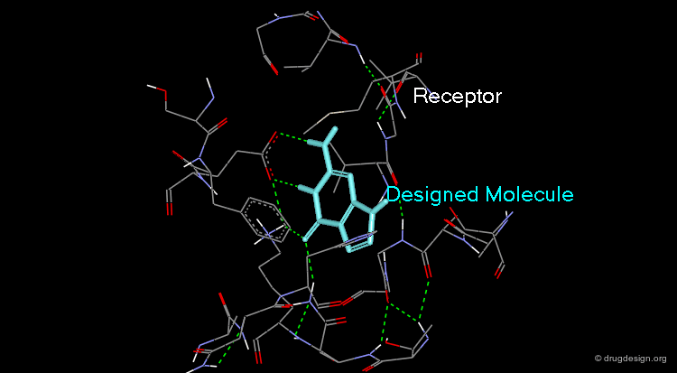

# Scientific Computing for Drug Discovery

### Author: Peter Bui

## Goal

To extend the traditional molecular dynamics (MD) simulations by enabling real-time visualization using CUDA for GPU acceleration. The application focuses on simulating and visualizing protein-ligand interactions to assist in drug discovery.

Simulating and visualizing protein-ligand interactions helps identify how a drug binds to its target protein, revealing binding sites, interaction strengths, and molecular behavior. This insight accelerates drug design by predicting the effectiveness of compounds before costly experimental testing.

## So what?

CUDA and GPUs significantly impact drug discovery by enabling much faster simulations of molecular interactions, which would otherwise take a prohibitively long time on traditional CPUs.

In drug discovery, understanding how a drug (ligand) interacts with a target protein is critical. This is typically done using molecular dynamics (MD) simulations, which model how atoms in the protein and ligand move and interact over time. However, these simulations are computationally expensive because they involve calculating the forces between thousands or even millions of atoms.

## How CUDA and GPU Acceleration Help

**Parallel Processing**: CUDA, which is a parallel computing framework developed by NVIDIA, allows the simulation to be offloaded to the GPU (graphics processing unit), which has many cores capable of performing computations simultaneously. GPUs can handle thousands of calculations in parallel, unlike CPUs, which typically handle fewer tasks at once. In MD simulations, this means that many atomic interactions can be calculated at the same time, speeding up the entire process.

**Faster Simulations**: With CUDA, the calculation of atomic interactions like forces and potential energy can be done much faster than on CPUs. For example, computing the forces between every pair of atoms in a simulation can be done in parallel for each pair, which drastically reduces computation time. This allows researchers to simulate more time steps or larger molecular systems in less time.

**Real-Time Visualization**: Once the simulation is running on the GPU, real-time visualization can be done through tools like OpenGL, which can render the movements of atoms as the simulation progresses. This visualization is crucial for understanding how the drug binds to the protein in real-time, watching the dynamic changes as interactions occur. It provides immediate visual feedback that can guide further analysis and decisions.

## Why It Matters in Drug Discovery

**Faster Insights**: Speeding up simulations allows researchers to quickly test multiple potential drug candidates without waiting for days or weeks. This helps them understand how different molecules might interact with the protein target, revealing which ones could be effective drugs.

**Cost-Effective Screening**: Simulating many compounds computationally before conducting costly experimental tests saves time and resources. Researchers can predict which drug candidates are most likely to succeed, reducing the number of compounds that need to be tested in the lab.

**Improved Accuracy and Detail**: With GPU acceleration, simulations can be run with more detail (e.g., finer time steps or larger molecular systems), improving the accuracy of predictions about binding and interactions. This can lead to better-targeted drug design.

## Specific Objectives

**Real-Time Force Calculations**: Utilize CUDA to accelerate the computation of interatomic forces for MD simulations, enabling simulations to run orders of magnitude faster than on CPUs.

**Visualization Pipeline**: Integrate CUDA with OpenGL to directly render atomic positions, allowing real-time observation of molecular interactions during simulation.

**Application to Drug Discovery**: Test the system by simulating protein-ligand binding dynamics, providing insights into binding affinities and molecular behavior.

## Current State of Knowledge/Previous Work

**CUDA in MD**: CUDA has been widely used to accelerate pairwise distance and force calculations in MD simulations (Assignment 6 and lecture notes on pair distribution with CUDA).

**OpenGL Visualization**: OpenGL has been utilized for post-processing MD data, but real-time integration with simulation calculations remains challenging (Assignment 7).

**Protein-Ligand Dynamics**: While MD simulations are commonly used in drug discovery, their time-consuming nature limits rapid iterations for testing multiple ligands.

Existing work separates simulation and visualization, with visualization performed only after simulations are completed. Integrating CUDA and OpenGL in a real-time pipeline for protein-ligand dynamics is a novel extension.

## Techniques to Be Used

**CUDA for MD Acceleration**: Use CUDA to calculate Lennard-Jones potentials and Coulombic interactions between particles. Exploit parallelism by mapping atomic pairs to CUDA threads to achieve massive speedups. Implement techniques to minimize GPU memory transfers, such as shared memory usage for neighboring particle data.

**OpenGL for Visualization**: Integrate CUDA with OpenGL to render atomic positions in real-time using Vertex Buffer Objects (VBOs). Color-code atoms to indicate interaction strength or molecular properties such as kinetic energy.

## Expected Results

**Speedup in Simulation**: Real-time simulation rates for systems of up to 10,000 atoms, enabling rapid feedback for researchers.

**Interactive Visualizations**: A fully integrated visualization pipeline allowing users to observe dynamic changes in protein-ligand interactions, such as binding/unbinding events.

**Application in Drug Discovery**: Enable rapid testing of multiple ligands against target proteins, reducing computational bottlenecks in the drug discovery pipeline.

**Scalability Insights**: Demonstrate scalability of the system for larger molecular systems with multiple GPUs.

## Proposed Techniques

Techniques from Assignments 3, 6, and 7 inform scalability testing, CUDA programming, and visualization pipelines, which are applied to this project.
